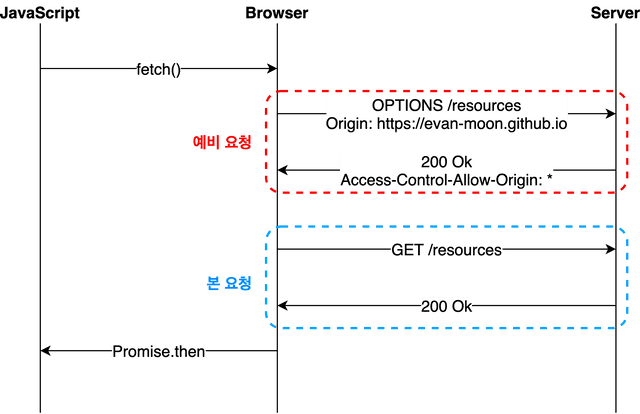
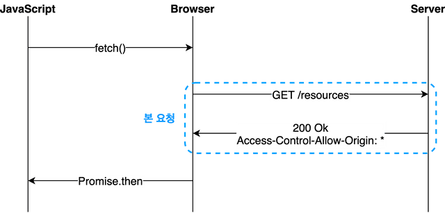

# CORS
CORS란 Cross Origin Resource Sharing의 약자이다, 직역하자면 Origin(host)를 가로질러 자원에 접근 할 수 있는 권한을 부여하도록 브라우저에 알려주는 정책이다.


예를들어 우리가 www.naver.com 웹페이지에서 api.daum/post/123 과 같은 api를 호출했다고 하자, 이 경우에 원하고자 했던 자원에 대한 출처는 api.daum이 된다.


# SOP(Same-Origin Policy)

웹 생태계에는 다른 출처로의 리소스 요청을 제한하는 것과 관련된 두 가지 정책이 존재한다. 한 가지는 이 포스팅의 주제인 CORS, 그리고 또 한 가지는 SOP(Same-Origin Policy)이다.

SOP는 지난 2011년, RFC 6454에서 처음 등장한 보안 정책으로 말 그대로 “같은 출처에서만 리소스를 공유할 수 있다”라는 규칙을 가진 정책이다.

그러나 웹이라는 오픈스페이스 환경에서 다른 출처에 있는 리소스를 가져와서 사용하는 일은 굉장히 흔한 일이라 무작정 막을 수도 없는 노릇이니 몇 가지 예외 조항을 두고 이 조항에 해당하는 리소스 요청은 출처가 다르더라도 허용하기로 했는데, 그 중 하나가 “CORS 정책을 지킨 리소스 요청”이다. (참고로 CORS라는 이름이 처음 등장한 것은 2009년이라, SOP의 등장보다 빠르다)

우리가 다른 출처로 리소스를 요청한다면 SOP 정책을 위반한 것이 되고, 거기다가 SOP의 예외 조항인 CORS 정책까지 지키지 않는다면 아예 다른 출처의 리소스를 사용할 수 없게 되는 것이다.

즉, 이렇게 다른 출처의 리소스를 사용하는 것을 제한하는 행위는 하나의 정책만으로 결정된 사항이 아니라는 의미가 되며, SOP에서 정의된 예외 조항과 CORS를 사용할 수 있는 케이스들이 맞물리지 않을 경우에는 아예 리소스 요청을 할 수 없는 케이스도 존재할 수 있다.

서로 다른 두개의 어플리케이션을 그냥 쉽게 통신을 가능하게 한다면 CSRF 또는 XSS 와 같은 공격에 노출되어 있게 되는데 이런 공격들을 제재하기 위한 정책이라고 생각하면 된다.

# 출처란(Origin)?
우리가 흔히 알고있는 URL은 다양한 요소로 구성되어 있다.

https://blog.naver.com/dnvld1/?page=1 라는 URL이 있다고하면 이는 아래와같이 구성되어 있습니다.
- https:// -> protocol
- blog.naver.com -> domain
- /dnvld1 -> path
- /?page=1 -> query string

출처란 프로토콜을 포함한 도메인을 의미합니다. (이 도메인에는 port번호가 포함되어 있으며, port가 다른경우에도 다른 출처로 봅니다.)

## CORS 동작 방식

## Preflight Request
```
프리플라이트(Preflight) 방식은 일반적으로 우리가 웹 어플리케이션을 개발할 때 가장 마주치는 시나리오이다. 이 시나리오에 해당하는 상황일 때 브라우저는 요청을 한번에 보내지 않고 예비 요청과 본 요청으로 나누어서 서버로 전송한다.
```

이때 브라우저가 본 요청을 보내기 전에 보내는 예비 요청을 Preflight라고 부르는 것이며, 이 예비 요청에는 HTTP 메소드 중 OPTIONS 메소드가 사용된다. 예비 요청의 역할은 본 요청을 보내기 전에 브라우저 스스로 이 요청을 보내는 것이 안전한지 확인하는 것이다.



우리가 자바스크립트의 fetch API를 사용하여 브라우저에게 리소스를 받아오라는 명령을 내리면 브라우저는 서버에게 예비 요청을 먼저 보내고, 서버는 이 예비 요청에 대한 응답으로 현재 자신이 어떤 것들을 허용하고, 어떤 것들을 금지하고 있는지에 대한 정보를 응답 헤더에 담아서 브라우저에게 다시 보내주게 된다.

이후 브라우저는 자신이 보낸 예비 요청과 서버가 응답에 담아준 허용 정책을 비교한 후, 이 요청을 보내는 것이 안전하다고 판단되면 같은 엔드포인트로 다시 본 요청을 보내게 된다. 이후 서버가 이 본 요청에 대한 응답을 하면 브라우저는 최종적으로 이 응답 데이터를 자바스크립트에게 넘겨준다.

# Simple Request

단순 요청은 예비 요청을 보내지 않고 바로 서버에게 본 요청부터 때려박은 후, 서버가 이에 대한 응답의 헤더에 Access-Control-Allow-Origin과 같은 값을 보내주면 그때 브라우저가 CORS 정책 위반 여부를 검사하는 방식이다. 즉, 프리플라이트와 단순 요청 시나리오는 전반적인 로직 자체는 같되, 예비 요청의 존재 유무만 다르다.



```
이 요청은 CORS의 preflight를 트리거하지 않고 단순히 요청을 하고, 이 요청은 아래와 같은 조건이 설정되었을때 발생합니다.

1. 요청의 메소드는 GET, HEAD, POST 중 하나여야 한다.

2. Accept, Accept-Language, Content-Language, Content-Type, DPR, Downlink, Save-Data, Viewport-Width, Width를 제외한 헤더를 사용하면 안된다.

3. 만약 Content-Type를 사용하는 경우에는 application/x-www-form-urlencoded, multipart/form-data, text/plain만 허용된다.
```
2번이나 3번 조건 같은 경우는 조금 까다롭다

사용자 인증에 사용되는 Authorization 헤더 조차 저 조건에는 포함되지 않는다.

게다가 대부분의 HTTP API는 text/xml이나 application/json 컨텐츠 타입을 가지도록 설계되기 때문에 사실 상 이 조건들을 모두 만족시키는 상황을 만들기는 그렇게 쉽지 않다.

# Credentialed Request

CORS는 기본적으로 보안상의 이유로 쿠키를 요청으로 보낼 수 없도록 막고 있습니다. 하지만 다른 도메인을 가진 API 서버에 자신을 인증해야 정상적인 응답을 받을 수 있는 상황에서는 쿠키를 통한 인증이 필요합니다.

이를 위해서 두 가지 작업이 필요합니다.

- 요청을 credentials 모드로 설정하기
- 서버에서 응답 헤더로 Access-Control-Allow-Crendentials: true 설정하기

CORS는 Access-Control-Allow-Credentials 헤더를 지원합니다. 요청이 credentials 모드이면서 서버가 Access-Control-Allow-Credentials 헤더를 true로 설정하여 응답하면, credentials를 이용한 요청을 처리할 수 있습니다.

prefilght request의 경우, 실제 요청과 함께 credentials를 보낼지 판단하는데 사용됩니다. 만약 Access-Control-Allow-Credentials: false이거나 생략한 경우, 실제 요청을 서버에 보낼 떄 credentials 정보를 함께 보내지 않습니다.

간단한 GET 요청의 경우는 prelight 과정이 없기 떄문에, credentials 정보와 함께 CORS 요청을 합니다. 단, 서버에서 Access-Control-Allow-Credentials: false이거나 생략한 경우, 응답을 브라우저가 자바스크립트 코드에 노출시키지 않습니다. 즉, 전달하지 않습니다.

# 주의사항

## Access-Control-Allow-Origin은 여러 출처를 명시할 수 없다!

스펙상 Access-Control-Allow-Origin은 하나의 origin이나 *, null만 가질 수 있습니다. 그렇기 때문에 서브 도메인의 접근 허용을 위해 *.example.com로 헤더 값을 설정하는 것은 스펙상 맞지 않습니다.

그래서 여러 출처의 접근 허용을 위해 * 값을 쓰는 경우가 많습니다. 하지만 *는 모든 출처의 접근을 허용하는 것이기 때문에 보안상 좋지 않습니다.

### Origin 헤더를 이용한 Whitelist 관리
요청이 오면 CORS 요청 헤더의 Origin 값을 확인하여, 별도로 관리하고 있는 Whitelist에 포함되고 있는지 확인하면 됩니다.

만약 존재한다면, Access-Control-Allow-Origin헤더의 값으로 해당 Origin의 값을 넣어 응답할 것이고, 브라우저는 실제 요청을 서버에 보낼 것입니다. 악의적인 사이트에서 요청을 보냈더라도, Whitelist에 포함되어 있지 않기 때문에 안전하게 CORS 요청을 처리할 수 있습니다.

CORS의 Whitelist를 직접 처리할 수도 있지만, cors 미들웨어가 이미 지원하고 있기 때문에 다음과 같이 작성하면 Whitelist를 편하게 관리할 수 있습니다.


## Access-Control-Allow-Origin의 값에 scheme과 port는 꼭 명시되어야 한다!

Access-Control-Allow-Origin 헤더 값을 설정할 때, 자주 하는 실수 중 하나가 host 이름만 명시하는 경우입니다. www.test.com과 같이 scheme(protocol)를 생략하거나 포트번호가 80번이 아닌데도 포트번호를 생략한 경우입니다.

Accecc-Control-Allow-Origin의 헤더 값은 origin 스펙을 만족하는 값이기 때문에 **[scheme]://[host]:[port]** 형태로 명시해야 합니다. origin 스펙을 준수하지 않으면, 브라우저 단에서 Origin 헤더의 값과 비교를 잘못할 수 있기 때문에 꼭 origin 스펙을 준수해야 합니다.


## Access-Control-Allow-Origin: *와 Access-Control-Allow-Credentials: true는 함께 사용할 수 없다.

CORS는 응답이 Access-Control-Allow-Credentials: true 을 가질 경우, Access-Controll-Allow-Origin의 값으로 *를 사용하지 못하게 막고 있습니다.

Access-Control-Allow-Credentials: true를 사용하는 경우는 사용자 인증이 필요한 리소스 접근이 필요한 경우인데, 만약 Access-Control-Allow-Origin: *를 허용한다면, CSRF 공격에 매우 취약해져 악의적인 사용자가 인증이 필요한 리소스를 마음대로 접근할 수 있습니다. 그렇기 때문에 CORS 정책에서 아예 동작하지 않도록 막아버린 것입니다.

Access-Contorl-Allow-Credentials: true인 경우에는 반드시 Access-Control-Allow-Origin의 값이 하나의 origin 값으로 명시되어 있어야 정상적으로 동작합니다.

---
spring에서 cors를 처리하는 방법

- HttpServletResponse에서 헤더를 직접 추가(Access-Control-Allow-Origin으로 해당 자원에 접근하는 곳 정보 입력)
- @CrossOrigin 어노테이션 사용
  - 메서드, 클래스 단위로 사용 가능하며, response에 헤더 추가하듯이 파라미터로 allow origin에 대한 정보를 입력하면 된다.
- WebMvcConfigurer
  - Spring Bean으로 WebMvcConfigurer를 등록하면서 CorsRegistry라는 객체에 허용 http 메서드, origin을 설정할 수 있다.
  - ex)
  ```
      @Bean
      public WebMvcConfigurer webMvcConfigurer() {
          return new WebMvcConfigurer() {
          
              @Override
              public void addCorsMappings(CorsRegistry registry) {
                  registry.addMapping("/**")
                              .allowedMethods("GET", "POST", "PATCH", "DELETE", "OPTIONS")
                              .allowedOrigins("http://localhost:3000");
            }
          };
      }
  ```
