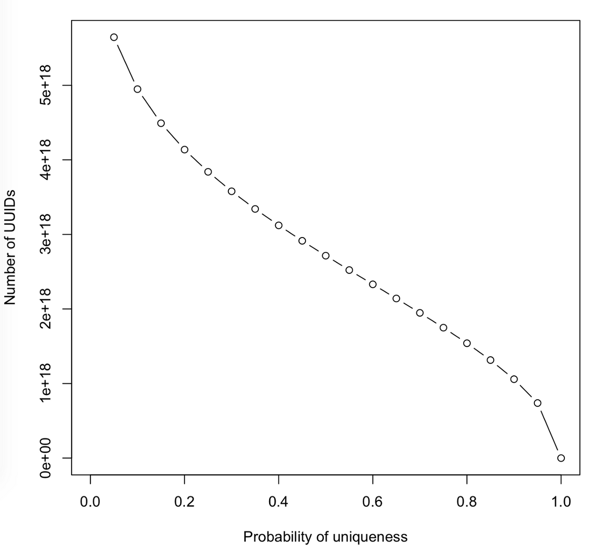

# Identifier

## UUID 
범용 고유 식별자(汎用固有識別子, 영어: universally unique identifier, UUID)는 소프트웨어 구축에 쓰이는 식별자 표준으로 Id를 만들때 사용할 수 있는 표준 식별자이다.

UUID는 32개의 16진수와 4개의 하이픈으로 표현 되며 다음과 같은 형태를 가진다.
(ex. 550e8400-e29b-41d4-a716-446655440000)

총 340,282,366,920,938,463,463,374,607,431,768,211,456개의 사용가능한 UUID가 있다고 한다.

`uuid 중복?!`

이론상 가능성은 있다고 하나, 사실 숫자만 봐도 희박해보이지만 한 블로그 글을 참고하면 매 초 10억개의 uuid를 100년에 걸쳐서 생성할 때 단 하나의 uuid가 중복될 확률은 50%라고 하니 그냥 걱정없이 사용해도 될거같다.

참고 : https://kingofbackend.tistory.com/173

JAVA에서는 UUID 만드는것을 기본으로 지원함(Util 패키지) 
- https://docs.oracle.com/en/java/javase/11/docs/api/java.base/java/util/UUID.html

```
String id = UUID.randomUUID().toString().replace("-", "");
```

그런데 uuid는 정렬되어 있지 않음. -> 좀 더 sortable한 거는 없을까? => ULID

## ULID (Universally Unique Lexicographically Sortable Identifier)
- https://github.com/ulid/spec

java에서 사용하려면 아래와 같은 의존성을 추가해줘야한다.
```
<!-- https://search.maven.org/artifact/com.github.f4b6a3/ulid-creator -->
<dependency>
  <groupId>com.github.f4b6a3</groupId>
  <artifactId>ulid-creator</artifactId>
  <version>5.1.0</version>
</dependency>

implementation 'com.github.f4b6a3:ulid-creator:5.1.0'
```

## TSID (Time-Sorted Unique Identifiers)
- https://github.com/f4b6a3/tsid-creator

ULID를 개선한 것으로 Time 순서로 정렬되어 사용가능함.

```
<!-- https://search.maven.org/artifact/com.github.f4b6a3/tsid-creator -->
<dependency>
  <groupId>com.github.f4b6a3</groupId>
  <artifactId>tsid-creator</artifactId>
  <version>5.2.3</version>
</dependency>

implementation 'com.github.f4b6a3:tsid-creator:5.2.0'
```
위와 같이 의존성 추가하여 자바 라이브러리 사용 가능
