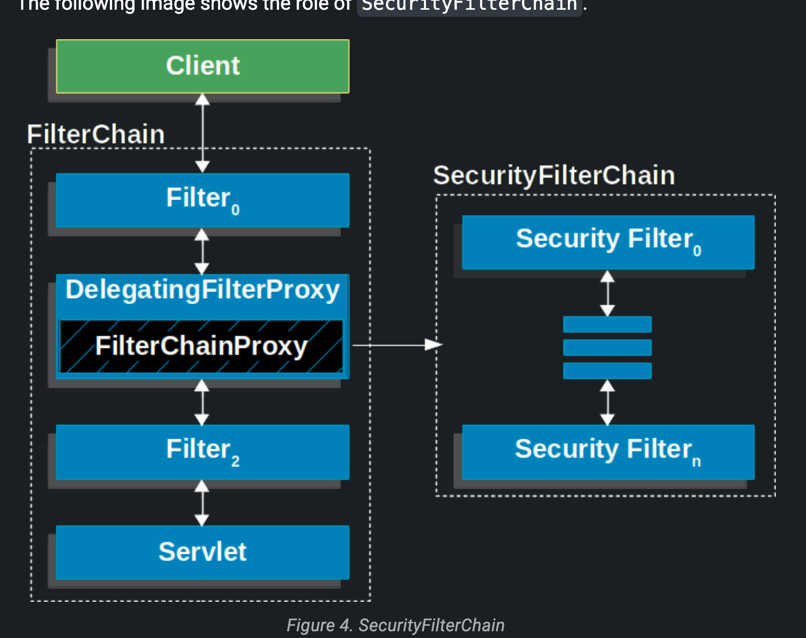

# 어플리케이션 레벨에서의 보안

### 인증/인가
- 인증 : 사용자가 어플리케이션(혹은 통신과정에서)에 접근 할 때 본인임을 증명하는 행위(id/pw, otp와 같은 방법)
- 인가 : 인증받은 사용자가 해당 서비스에 부여된 권한을 검사하는것(ex. 사용자가 관리자만 접근할 수 있는 페이지에 접근 하지 못하도록 하는것, 일반 사용자가 다른 사용자 정보에 접근 못하도록 하는 등)

인증/인가가 필요한 요청을 사용자가 하는 경우 handlerInterceptor 로 컨트롤러에 요청이 도착전에 처리하거나 
Spring Security를 사용하면 서블릿의 필터 기반으로 인증/인가를 처리함.

- 필터는 서블릿 스펙에 정의된 기술이고, 서블릿 컨테이너에서 생성 및 실행된다.
  - 빈 or 스프링에서 사용하는 기술을 필터에서 사용하지 못함.
  - 하지만, 스프링 시큐리티는 필터기반으로 보안처리를 하며 실제 실행되는 각 필터들은 스프링 기술들을 사용 하고자 함.
    - 그래서 스프링 빈에서 서블릿 필터를 구현함.
      - 사용자의 요청은 was의 필터가 받아서 DelegatingFilterProxy(서블릿 필터)가 그 요청을 스프링에서 관리하는 필터에게 위임하는 역할을 한다.

### 주요 흐름

## 암호화
- 어떤 데이터(평문)를 다른 사람이 읽을 수 없게 만들어서 데이터를 보호하는 것을 암호화 라고 함. (알 수 없게 만든 데이터 : 암호문)
  - 일반적으로 암호문은 복호화를 통해서 평문으로 되돌릴 수도 있다. (양방향 암호화 / 평문 <-> 암호문)
  - 위와 다르게 한번 암호화한 데이터를 다시 평문으로 되돌릴 수 없는 것을 단방향 암호화라고 하고, 사용자의 비밀번호와 개인정보와 같은 것을 단방향 암호화를 통해 db에 저장한다.

### 단방향 암호화
- 단방향 암호화는 특정 해시 알고리즘을 사용해서 암호문을 만드는데 그 암호학적 해시 알고리즘은 다음과 같은 성질을 가지고 있다고 한다.

1. 역상 저항성 : 해시 값(암호문)으로 원래 값(평문)을 못찾아야한다.
2. 제2 역상 저항성 : 평문과는 다르지만 동일한 해시 값으로 변환되는 다른값을 찾을 수 없어야 한다.
   - 원래의 데이터는 아니지만, 암호화가 되는 형태를 유추해서 원래 데이터의 암호문과 같은 값을 찾을 수 없어야함.
3. 충돌 저항성
   - 다른 평문과 암호문이 같은 경우가 없어야 함.
   - 동일한 암호문으로 변환되는 두개의 평문을 찾을 수 없어야 함.

- 사용자의 패스워드를 단방향으로 암호화 하기 위한 알고리즘으로 예전에는 bcrypt나 scrypt를 사용했지만, 최근에는 `Argon2` 나 `Balloon`을 사용한다고 함.
- Argon은 Spring Security 에서도 지원함.
