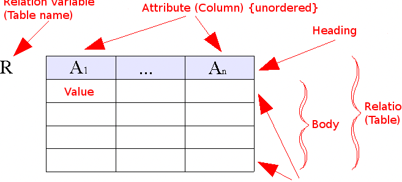
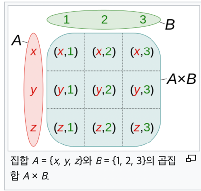

# DB (Database)

```
organized collection of data stored and accessed

구조화된 정보 or 데이터의 조직화된 모음을 데이터 베이스라고 함.
```

### DBMS (Database Management System)

- 말 그대로 데이터 베이스 관리 시스템
- 사실상 개발하면서 DB라고하면 DBMS를 뜻한다.
  - 사용자 or 응용 프로그램은 DB에서 데이터를 쉽게 찾고, 효율적으로 조작(CUD) 할 수 있어야 한다.
  - 또, 보안 문제, 접근 권한 문제를 다룰 수 있어야 함.

### DBMS에서 제공하는 언어
- DDL (Data Definition Language) -> 테이블 스키마와 관련
- DML (Data Manipulation Language) -> 데이터를 쿼리 or Command 하는 것과 관련
- DCL (Data Control Language) -> Grant, Revoke, Commit, Rollback 같은 형태

### Data Model

데이터 모델은 보통 크게 3가지로 분류함.
1. Conceptual Data Model (개념적 데이터 모델)
2. Logical Data Model (논리적 데이터 모델)
3. Physical Data Model (물리적 데이터 모델)

### Relational Model (관계형 모델)

Entity-Relationship Model(ERM)과 Relational Model(RM)
- 엄격하게 따지면 ERM의 Relationship은 Entity 사이의 관계를 의미하고,
- Relational Model(RM)의 Relational은 Tuple의 집합을 의미함.
  맥락이 달라서 사실 아무 상관없는 다른 용어지만 실용적으로 사용할때는 거의 같은 의미로 쓰이는 경우가 많음

### 관계형 모델에서 쓰이는 3가지 개념
- Relation
- Tuple
- Attribute

`속성(Attribute)`

- 속성은 이름과 타입으로 구성되고 이름은 속성 집합 안에서 유일해야 함.
- 보통 column으로 구현됨.
  `ex) 이름/문자열`

`튜플(Tuple)`

- (속성, 값) 쌍의 집합. 으로 하나의 집합에서 속성 이름은 유일하기 때문에 겹치지 않아야함.

  `ex) { (이름/문자열, 견우), (나이/정수, 13), (성별/문자, 남) }`

- 보통 row, record로 구현됨.
- 이론상으로는 유일하지만, 대부분 RDBMS에서는 중복 및 NULL을 허용한다.

`관계 (Relation)`


- 관계(Relation)는 (속성의 집합, 튜플의 집합) 쌍.
- 속성의 집합을 heading, 튜플의 집합을 body라고 구분한다.
- 그냥 관계는 “튜플의 집합”이라고 할 수도 있다.

관계는 대부분 Table로 구현되고, 속성 집합을 Schema라고 표현한다.

# Relational Algerbra (관계 대수)

### 연산
- 하나 이상의 Relation으로 새로운 Relation을 만들 수 있음.
  - ex) Projection 과 같이 조회할때 원하는 Attribute을 가져오는 것도 하나의 새로운 Relation을 만드는 것이다.

### Projection
- 원하는 Attribute을 포함하는 Pair로 Tuple을 구성하는것.
```sql
SELECT name, age, gender
FROM people;
```
그냥 sql에서는 원하는 속성을 가져오는것으로 표현

### Selection
주어진 술어(조건)을 만족하는 Tuple만 선택
sql에서는 where로 표현
```sql
SELECT name, age, gender
FROM people
WHERE age < 13;
```

### Cartesian Product

Relation의 Cartesian Product는 원래 의미와 다르다. 
원래는 각 요소의 쌍을 요소로 취하지만(x와 y가 있다면 (x, y)를 새로운 요소로 사용), 관계 대수에서는 그냥 Tuple을 합친다.



- 대부분은 Cartesian Product를 그대로 사용하지 않고 Selection과 함께 사용하는데, 이를 Join이라고 한다.
- 보통 Cartesian Product은 조인으로 사용함.
```
σpeople.name = items.person_name(people × items)
σ = Selection
× = Cartesian Product
```
```
SELECT items.name AS name, usage, people.gender
FROM items
JOIN people ON items.person_name = people.name;
```

## Entity-Relationship Model (개체 관계 모델)

Entity는 개별적으로 다룰 수 있는 데이터이고, ER 모델에서 Relationship은 Entity 사이의 관계를 의미하고, 개념적 데이터 모델이다.
같은 Attribute를 가진 Entity를 Entity Type이라고 하며, ERD등을 그릴때 사용하는 것은 Entity Type이다.
- 참고로, OOP, DDD에서 Entity를 연속성과 식별성이 있는 객체란 의미로 사용한다. 
- 똑같이 Entity란 표현을 사용하지만 실제로는 완전히 다른 의미이다.(ER모델에서의 엔티티는 데이터이고 행위가 없음, OOP, Jpa에서 사용되는 Entity는 행위가 있을 수 있음.)
  - 데이터 모델링과 객체 모델링은 목표, 용어, 원칙등도 다르니 다르다는것에 유의하자.

=> 같은 단어라도 문맥에 따라서 다른 의미인 경우가 매우 많으니 아는 단어 나왔다고 넘겨짚지말고 잘 파악해서 이해하도록 하자.

### ERD (Entity-Relationship Diagram)
[ER Diagram MMORPG](https://commons.wikimedia.org/wiki/File:ER_Diagram_MMORPG.png)
[Cardinality (data modeling)](https://en.wikipedia.org/wiki/Cardinality_(data_modeling))
- 개념적 데이터 모델인 ER모델을 시각화하는 방법으로 논리적 설계에 들어가기 전에 그려보면 도움이 됨.
  - 도구나 표기법에 집착하지말고, 모델을 검증하는 도구로 사용하자.
- 도구나 표기법에 집착x, 모델을 검증하고 엔티티를 발견하고 적절하게 재배치하는것에 집중하면 많은 통찰력을 얻을 수 있다.
- 마름모로 표시되는 Relationship을 생략하지 말고 "읽을 수 있도록 말이 되는 설계"를 하면 도움이 됨.

# JDBC (Java Database Connectivity)
- java에서 RDBMS를 사용할 수 있게 해주는 API
- API는 그냥 인터페이스기 때문에 각 DBMS 벤더에서 제공하는 JDBC Driver가 필요하다.

```
implementation 'org.postgresql:postgresql:42.5.4'
```
약간 로우한 방법을 통한 쿼리를 하는 방법 벤더에 맞는 JDBC 추가 후 Connection 얻고 statement를 통해 원하는 쿼리를 하고 ResultSet을 통해 결과를 받아옴.

Statement와 PreparedStatement의 차이점

`가장 큰 차이점은 캐시 사용 여부이다.`

- Statement는 쿼리를 실행하기 전에 문자열로 작성된 SQL 쿼리를 DBMS에 보내는 데 사용됨. 

쿼리를 실행할 때마다 새로운 SQL문을 작성하고 컴파일해야 합니다. 이로 인해 동일한 쿼리를 여러 번 실행할 때 성능이 떨어질 수 있습니다.

- PreparedStatement는 SQL 문을 미리 컴파일하여 쿼리의 일부 또는 전체를 매개 변수화할 수 있습니다.

이 매개 변수는 쿼리 실행 시에만 설정됩니다. 따라서 매번 SQL문을 컴파일할 필요가 없어져 성능이 향상됩니다. 

또한, PreparedStatement를 사용하면 SQL 쿼리의 구문 검사가 더욱 엄격하게 이루어지기 때문에 SQL Injection 공격을 예방할 수 있습니다.

따라서, PreparedStatement는 Statement보다 더 나은 성능과 보안을 제공합니다. 


