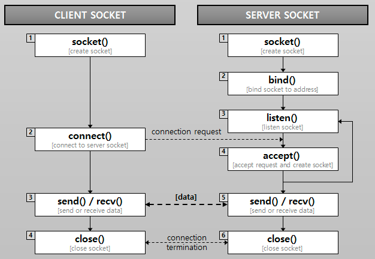
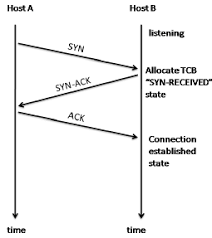

# Http Client

### TCP/IP 통신

- 가장 많이 쓰이는 인터넷 프로토콜 스위트(Internet Protocol Suite)로 여러 인터넷 프로토콜 스위트가 있지만 가장 많이 쓰이기 때문에 TCP/IP 프로토콜 스위트라고도 불림.

TCP와 UDP

전송계층의 대표적인 프로토콜이다.

- TCP : 연결지향적인 프로토콜이다.
- UDP : 연결하지 않고 데이터를 보내는 방식의 프로토콜(구현에 따라 연결하도록 할 수 있음.)

### Socket

- 네트워크의 소켓은 프로세스 간 통신의 엔드포인트(종착점)이다.
- 소켓은 파일과 유사하게 다룰 수 있음.(유닉스에서는 파일 디스크립터의 일종이라고 함.)
- 자바에서는 IO로 Stream 기반으로 소켓 통신을 다룰 수 있다.

### TCP 소켓 통신의 순서
1. 서버는 접속 요청을 받기 위한 소켓을 연다 (Listen)
2. 클라이언트는 소켓을 만들고, 서버에 접속을 요청한다.(Connect)
3. 서버는 접속 요청을 받아서 클라이언트와 통신할 소켓을 따로 만든다.(Accept)
4. 소켓을 통해 서로 데이터를 주고 받는다. (Send/ Receive 반복)
5. 통신을 마치면 소켓을 닫는다. (Close / 상대방은 Receive로 인지함.)

(참고 : https://helloworld-88.tistory.com/215)

### TCP (전송계층)에시의 통신

- tcp 통신은 연결 지향적이기 때문에 연결(Connection)을 맺는 과정이 필요하다.

### 연결을 맺는 과정 (3-way handshake)

### 연결을 끊는 과정 (4-way handshake)

- 연결을 끊을 때 FIN-ACK 이후에 TIME-WAIT 하고 CLOSED를 하는데 이유는 중간에 지연되거나 유실된 패킷이 뒤늦게 전송되는 경우가 있기 때문이다.

### 서버에 접속하기 위한 HTTP 클라이언트
1. Connect
2. Request
3. Response
4. Close

위 과정을 거쳐서 Http 클라이언트에서 서버에 접속 및 연결 종료를 수행한다.

- Connect
  - Http 클라이언트에서 서버에 연결 시도 시 필요한 정보는 크게 Host, Port로 나눌 수 있다.
  - Host는 IP 주소 또는 도메인 이름을 사용.
  - Port는 해당 호스트가 사용하는 프로그램 중 어떤 프로그램에 접속할지 나타내는 값.
    - HTTP의 기본 포트는 80, HTTPS(ssl)의 포트는 443 이다.
