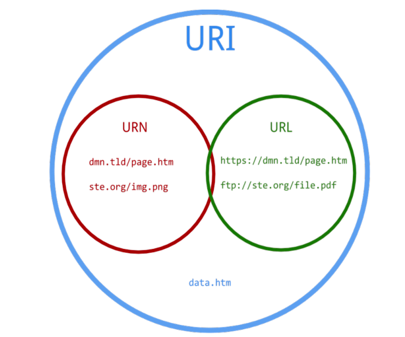

# Rest (Representational State Transfer)

시스템을 여러 tier/layer로 구분할 수 있고, tier는 물리적인 부분, layer는 논리적인 부분을 말한다.

FE, BE를 연결하는 방법이 다양한데 최근에는 http를 이용한 웹 기술들을 활용하고 rest api로 통신한다.
이외에도 SOAP, GraphQL등 다른 것도 사용할 수 있다.

API(Application Programming Interface)
- api는 컴퓨터와 컴퓨터 사이의 연결이라고 할 수 있다.

인터페이스
- 구현과 상관없이 어떻게 사용하거나, 통신할 것인지에 대한 명세가 존재함. (Communication, Specification)
- 정보 은닉
  - 어떻게 구현되는지는 상관없이 뒤로 숨겨서 사용자는 스펙에 맞게 사용하기만 하면 된다.
    - 연동할 구체적인 구현이 없는 상태에서도 (인터페이스 만으로) 정확한 연동 코드의 생성이 가능함.
  - 구체적인 것들에 의존하는 것을 막아줌으로써 객체간의 구체적인 결합도를 약화시켜 기능의 교체나 변경이 쉽도록 한다.
  - 동일한 타입의 다른 구현 객체들을 교체함으로써 동적 기능 변경이 가능함.
- 캡슐화
  - 정보은닉을 하는 방법 중 하나로, 객체 혹은 인터페이스에 대한 것을 하나로 묶어주는 것
- 구현(implementation)
  - 어떻게 구현되든지 상관없음.

# REST

많은 데이터들이 있는데 통신을 할 때 사용하는 방법들을 다 개별적으로 할 수도 있지만, 하나의 원칙을 따르면 더 좋음. => 그래서 REST라는 것을 따른다. 

- Rest란 로이 필딩이라는 사람이 논문으로 처음 소개한 내용으로 http의 장점을 최대한 잘 사용하기 위한 아키텍처 스타일로서 REST를 발표했다고 함.
  - Architecture style : 어떤 아키텍처에 공통된 패턴과 같은 스타일을 적용한것이라고 함. 
[로이필딩 논문](https://www.ics.uci.edu/~fielding/pubs/dissertation/rest_arch_style.htm)

### Rest 스타일을 만족시키는 제약조건들
- Starting with the Null Style
  - null 스타일은 단순히 빈 제약조건 집합을 의미. 아키텍처 관점에서 null 스타일은 구성 요소간 구별되는 경계가 없는 시스템을 말함.

- Client-Server
  - 클라이언트 - 서버 아키텍처 스타일을 말함.
  - 클라이언트와 서버를 분리함으로써 서로간 의존성을 줄이고, 독립적으로 발전할 수 있도록 한다.

- Stateless
  - 본질적으로 상태를 가지지 않는다. (http가 무상태이므로 rest도 무상태성)
    - Server는 각각의 요청을 완전히 별개의 것으로 인식하고 처리한다.
    - 각 API 서버는 Client의 요청만을 단순 처리한다.
    - 즉 , 이전 요청이 다음 요청의 처리에 연관되어서는 안된다.
    - 이전 요청이 DB를 수정하여 DB에 의해 바뀌는 것은 허용한다.
    - Server의 처리 방식에 일관성을 부여하고 부담이 줄어들며, 서비스의 자유도가 높아진다.
  - 상태를 가지지 않으면 단일 요청만 신경쓰면 되고, 부분 장애 복구가 가능해짐.
  - 또한, 확장성이 향상됨.

- Cache
  - 웹 표준 HTTP 프로토콜을 그대로 사용하므로 웹에서 사용하는 기존의 인프라를 그대로 활용할 수 있다.
    HTTP가 가진 가장 강력한 특징 중 하나인 캐싱 기능을 적용할 수 있다.

- Uniform Interface
  - 다른 네트워크 베이스 스타일과 구분되는 REST 아키텍처 스타일의 주요 기능은 동일한 인터페이스에 대한 것임.
  - 소프트웨어 공학의 원리를 컴포넌트들에 적용하면 시스템 아키텍처가 단순화 되고, 시스템 간 상호작용 가시성이 좋아짐
  - REST 인터페이스는 대용량 하이퍼미디어 데이터 전송에 효율적으로 설계되어있음.
    - 웹에서 일반적인 경우에 대해 최적화하지만 일반적이지 않은, 다른형태의 아키텍처 상호 작용에는 맞지 않을 수 있음.
  - 균일한 인터페이스를 얻으려면 컴포넌트들의 행위를 가이드하는 여러 아키텍처 제약조건이 필요함.
  - 그래서 REST는 다음 네 가지 인터페이스 제약 조건으로 정의됨.
    - 자원에 대한 식별
    - 표현을 통한 자원의 조작
    - 자기 서술적 메시지(self-descriptive messages)
    - hypermedia as the engine of application state (HATEOAS)

- Layered System

- Code-On-Demand

REST는 API를 위한 아키텍처 스타일이 아니다. 논문에서 밝힌 것처럼 “common case of the Web”에 특화된 방법이다. 

하지만 API를 만들 때 유용하게 활용할 수 있다고 함.

### Resources and Resource Identifiers 
- 여기서 아키텍처 요소 중 리소스와 표현을 구분한다.
- Resource는 특점 시점을 뜻하는 것이 하니라, 언제든 통용되는 엔티티 집합을 말한다.(객체지향의 사실과 오해에서 말하는 "앨리스"는 형태가 변해도 앨리스임)
- Representation (표현)은 데이터, 메타데이터 등을 말하게 되는데 사실상 HTTP 메시지라고 보면된다.
  - 예를 들어, HTTP METHOD로 리소스 조작에 대한 것을 표현하고, 리소스를 어떻게 조작할지는 content-type, body로 표현한다.

### HATEOAS
- 표현을 통해 상태를 전환하는 행위를 할 수 있어야함. (하이퍼미디어 링크를 통해서 함.)
  - 하지만 대부분 효율 문제로 표현에 링크를 넣지 않고, api 문서를 통해 상태 전환을 서술하고, 해당 api 문서를 참조해서 상태 전환을 강제하는 형태
  - 사실 엄연히 말하면, 이렇게 하는 경우 표현을 통해 상태 전환을 나타낸게 아니기 떄문에 REST의 제약조건을 만족하지 못함. 
    - 얼마나 REST를 잘 지키는지 나타내는 REST 성숙도 모델이라는 것이 존재. ([리차드슨의 성숙도 모델](https://martinfowler.com/articles/richardsonMaturityModel.html))
    - 그 중 2단계가 가장 보편적으로 쓰이는 형태로 http method를 통해 행위를 표햔하고 status code를 이용해서 반환.
    - 3단계는 2단계를 포함하며, 응답에 하이퍼미디어 형태로 uri를 응답하고 해당 자원으로 무엇을 할 수 있는지 알려준다.
      - 해당 리소스로 다음에 어떤 행위를 할 때 어떻게 사용해야 되는지를 응답을 통해 알려주는 형태

