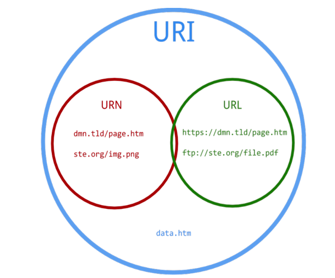

# URI

URL과 URI에 대해서 학습한적 있지만, 큰 구분 없이 사용해왔었다.

다시 한번, 정리해보자.

### URI (Uniform Resource Identifier)
- 위키 백과에는 통합 자원 식별자라 한다.

uri는 인터넷의 주소 같은 것으로 정보 리소스를 고유하게 식별하고 위치를 지정하는 것이다.
그리고 이 uri에는 두가지 형태가 있는데 바로 url과 urn 이다.

### URL (niform resource locator) 통합 자원 지시자
통합 자원 지시자(uniform resource locator, URL)는 URI의 가장 흔한 형태이다.

URL은 특정 서버의 한 리소스에 대한 구체적인 위치를 서술한다.

예를 들자면 아래와 같다. 
 
- http://naver.com - 네이버 사이트의 URL
- http://img.naver.net/static/www/dl_qr_naver.png - 네이버 앱 QR 코드의 이미지에 대한 URL
- http://news.naver.com/main/main.nhn?mode=LSD&mid=shm&sid1=104 - 네이버 뉴스에서 
분류 중 "세계" 주제의 기사에 대한 URL

URI의 두 번째 형태는 유니폼 리소스 이름(uniform resource name, URN) 이다.

URN은 콘텐츠를 이루는 한 리소스에 대해, 그 리소스의 위치에 영향 받지 않는 유일무이한 이름 역할을 한다.

이 위치 독립적인 URN은 리소스를 여기저기로 옮기더라도 문제없이 동작한다.

리소스가 그 이름을 변하지 않게 유지하는 한, 여러 종류의 네트워크 접속 프로토콜로 접근해도 문제없다고 한다.

개인적으로 urn을 접한 경험은 아직 없다.

그래서 예시를 보면

`urn:ietf:rfc:2141 - 'RFC 2141' 문서`

이런 형태가 되고 어떻게 접속해도 RFC2141 문서가 된다.

URN은 Url의 한계에 의해서 나타난것인데, 한계란,

URL은 주소이지 실제 이름이 아니다.

이 뜻은 특정 시점에 어떤 것이 위치한 곳을 알려준다는 것이다.

예로, www.domanin.com/10 이라는 링크가 있는데, 본인이 주소를 바꾸고 싶어서 해당 리소스의 주소를 www.domain.com/test/10 으로 변경한다면, 이전에 접근하는 방법으로는 해당 리소스를 찾을 수 없다.

uri, url, urn을 잘 나타낸 다이어그램

image.png
